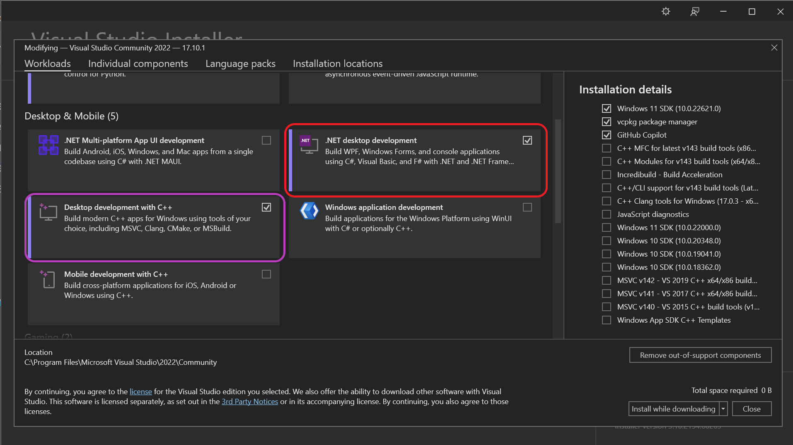

# The Krabby Patty Secret Recipe - An Intro to Shellcode Running (Workshop Repo)
**This repo is meant to be used during the Neon Temple Guild Night Talk given by Disc0rdantMel0dy.**

*The contents of this repo are meant for educational purposes only and should not be executed on any systems which are not owned by the operator, or on systems which the operator has not been given explicit permission to execute them upon.*

## How to use this repo
This repo contains three projects which are designed to teach the basic principles of shellcode running.  Two of the projects (Krabby_Patty_Clean and Krabby_Patty_Documented) are functional copies of each other with the only difference being the amount of code documentation provided.  These are provided as reference on how to build a simple "functional" shellcode runner.

The third repo (Krabby_Patty_Demo) is simply a skeleton program with comment in place to scaffold up the building of a runner from scratch.  This repo's existing code is simply the base template for a C# .NET console app from Visual Studio.  We will build the runner from the ground up during the demo sections of the class.

## Workshop Preparation 
Prior to the workshop, the following tasks will need to be done if you wish to follow along and build the loader during the talk.
- Ensure you have a Windows laptop or access to a Windows VM (You will need administrator level access to this host).
- You will need to either disable Windows Defender (or create an exclusion folder to house maldev projects).
- You should save this entire repo to the host 
  - Use Download link above
  - Alternatively, if you install git for windows, you can run the following command from cmd.exe to clone the repo
  > `git clone https://github.com/Disc0rdantMel0dy/Krabby_Patty.git`
- Install Visual Studio 2022 Community Edition
    - Download Visual Studio [here](https://visualstudio.microsoft.com/vs/community/) (`https://visualstudio.microsoft.com/vs/community/`)
    - After Visual Studio Installer is downloaded run the setup binary.
    - During setup it will ask you which components you wish to install.  
      - Installation of the **.NET desktop development pack** (red) is required for the workshop work.
      - Installation of the **Desktop Development with C++** (purple) is recommended if you wish to continue using the host for malware development.
      
      - **Please install this prior to guild night as the download is around 15GB** 
## Acknowledgements and Further Reading
This content would not have been possible without many folks along the way who helped me with my maldev journey.  Its far too many to list so thank you all. Oh and Caffiene!  Thank you caffiene for keeping me up as I bootstrapped this knowledge for some operation or another.

The slideware presented in this talk is also inside the repo in PPTX (with presentation notes) or in PDF format.